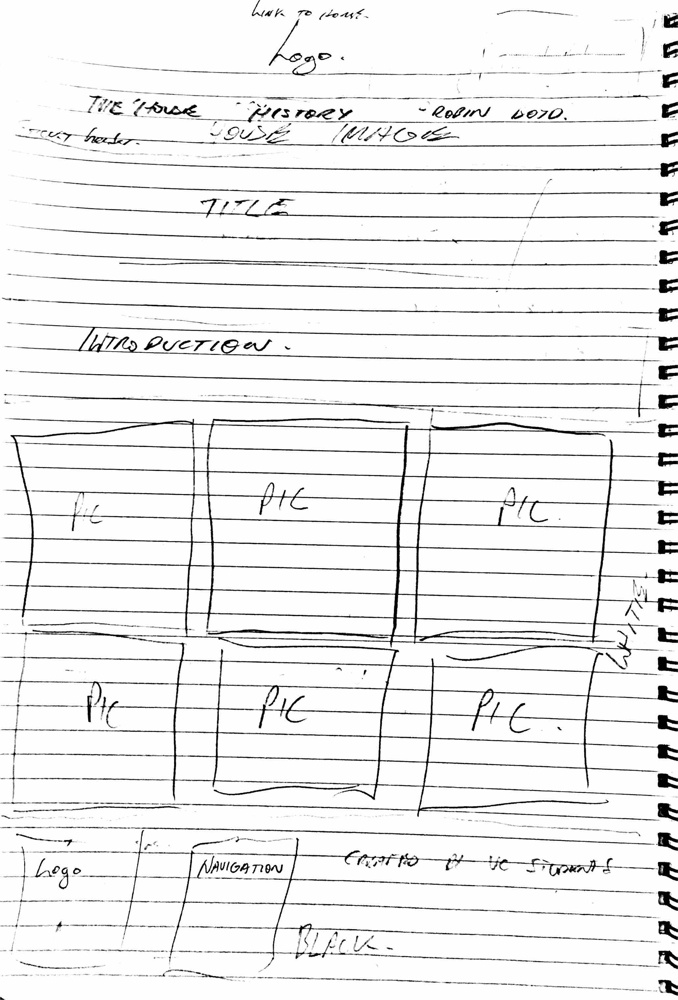
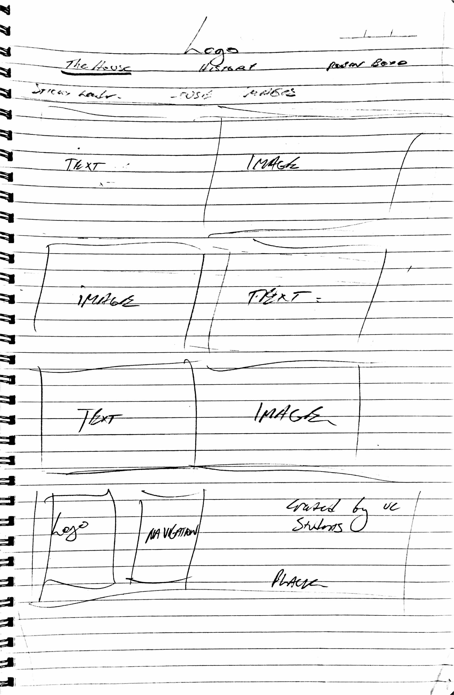
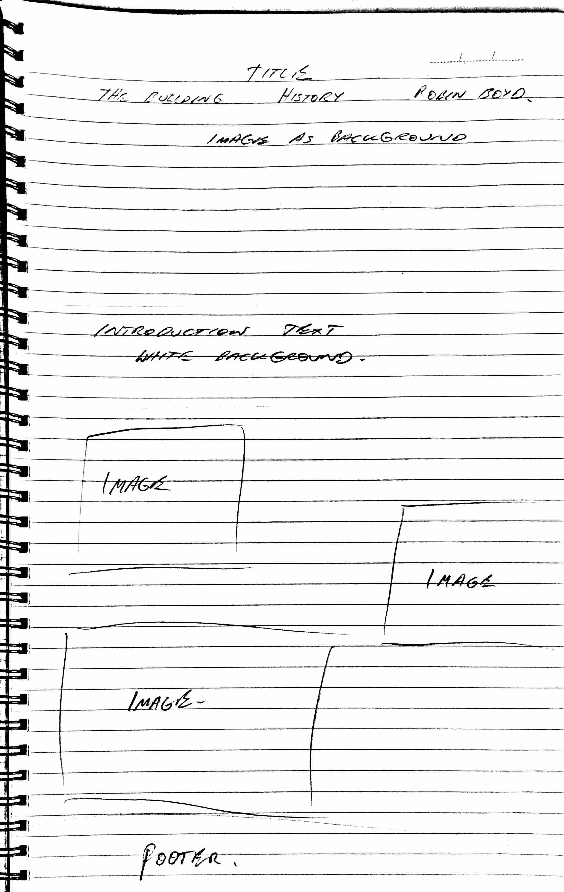

## Front-end Web Design 11056
## Assignment 2 Rationale

#### By U3160099

My goal for the website was to have a good user experience, I believe this is more important than an overly fancy appearance. I got some of my inspiration for a good user experience from “don’t make me think”. Examples of this are the headings changing colour when hovered over to indicate they are selectable, the clear menu at the top of each page to show which page has been selected and having the title as a link back to the home page to ensure users don’t get lost. 

I began by sketching my website on paper (pictured below). I then created the proposed layout in Visio. I was planning to have random image sizes and positions on the main page, with each heading over the image. Once I built the website this way, I found it to instead look un-organised, and having the text over the image both obscured the image and made the text difficult to read. I then tried to put a background colour under the text, although it was readable this obscured too much of each image. The end solution was to move the text half off the image. I got the idea for this from the Eiffel tower website. https://www.toureiffel.paris/en. Large line height was used to allow for easy reading. 

In my early drafts, I was planning to use a logo. I found this to make the header too busy, a lot of websites that I looked at simply had the title text with no logo.

In order to make my website responsive across all devices, I used the process that was suggested [here](https://responsivedesign.is/strategy/page-layout/defining-breakpoints/). I began by adding an extension to my browser to show the screen width. I then narrowed the screen down to iphone 5 width, since there are not many phones in use today with a smaller width than this. I then scaled the width up, until I decided the website needed a breakpoint. I added the break point in and continued to scale up until another breakpoint was required. I did this until I reached a width of 1920 pixels. 

I was having difficulty with the grid and making the gaps even when the website was scaled, I was making the mistake of having each image or paragraph as its own item in the grid, the solution was to just have 2 columns and put all the content in each of the 2 columns. I found the grid to be very easy to use once I got the hang of it. Another issue I had was the chrome responsive device tester was ignoring my breakpoints. This was because I did not include &ltmeta name="viewport" content="width=device-width,initial-scale=1"&gt in my header. I have tested the website on Mac with Safari, and on Windows with Chrome with no major issues (no overlapping of text and images etc).   

In the end the final website looked quite like the original sketches. I was proposing to use a light colour scheme for the backgrounds, but in the end, decided to go with dark, as I thought this worked better with the warm coloured pictures.

